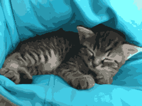
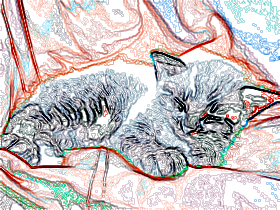
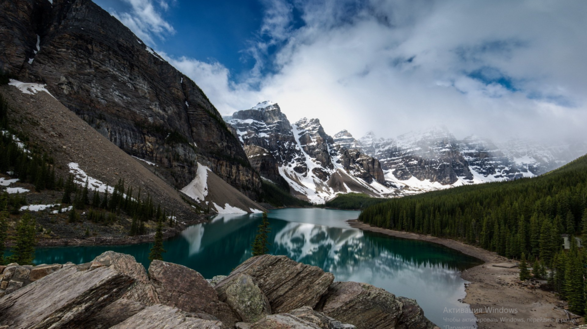

# Лабораторная 2
## Задание: 
Реализовать программу для накладывания фильтров на изображения. Возможные фильтры: размытие, выделение границ, избавление от шума. Измерить время.

Для работы с графическими файлами рекомендуется использовать libpng (man libpng). Примеры использования библиотеки в /usr/share/doc/libpng12-dev/examples/

Считать изображение из файла, преобразовать в массив, отправить на CUDA Device, провести на устройстве обработку фильтром, вернуть изображение в память хоста, преобразовать в картинку, сохранить файл.

## Ход работы
1.Задание было выполнено на кластере cluster-gpn.nsu.ru

2.Было реализовано три фильтра - гауссовское размытие, фильтр Собеля, медианный фильтр.

3.В качестве изображений (.png) было выбрано два:

    -Изображение№1 (cat1.png):280*210
    -Изображение№1 (cat2.png): 997*637

4.Расчет времени (milliseconds) выполнения на GPU и CPU.

## Результаты
**Размер картинки: 280*210**

GPU

Filter

#### blur: 6.82
#### edge: 0.03
#### denoise: 0.04

____

CPU

Filter

#### blur: 6.34
#### edge: 6.44
#### denoise: 12.41

____

**Размер картинки: 997*637**

GPU

Filter

#### blur: 8.11
#### edge: 0.09
#### denoise: 0.15

_____

CPU

Filter

#### blur: 68.34
#### edge: 70.33
#### denoise: 126.4151

## Выводы:

    1.На GPU самую высокую производительность получаем при применении Собеля, поскольку операция Собеля требует только простых 
    целочисленных умножений и сложений, а также вычисления квадратного корня, что эффективно выполняется на GPU. При этом нет 
    дополнительных накладных расходов на сортировку или сложную арифметику.
    2.Гауссовскоого размытия эффективнее работает на CPU.
    3.На CPU самую низкую производительность получаем, напротив, при применении медианного фильтра, поскольку для каждого пикселя 
    требуется собрать 9 значений, затем отсортировать их (в коде — пузырьковая сортировка на GPU, std::sort на CPU), чтобы 
    выбрать медиану.

## Визуализация для изображения№1:

## Визуализация для изображения№2:

